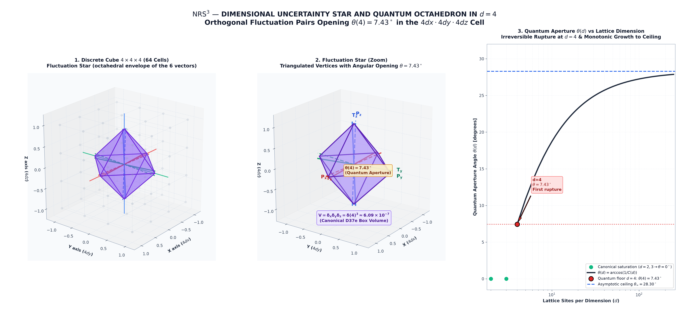
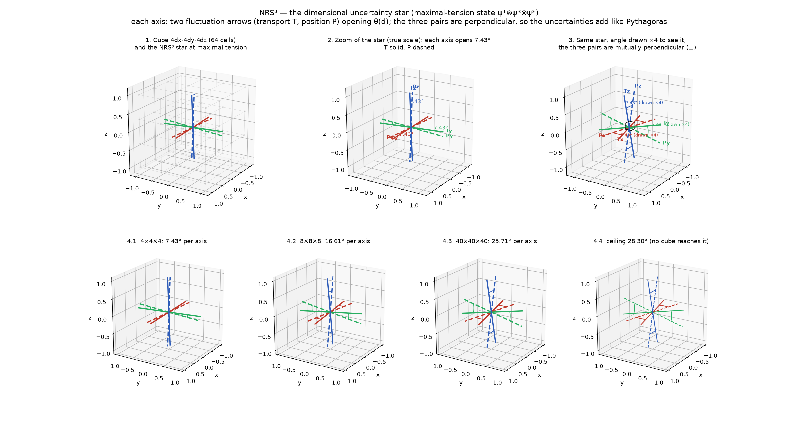
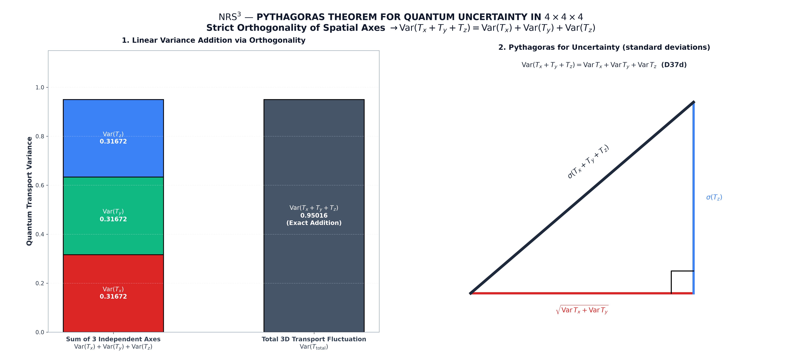
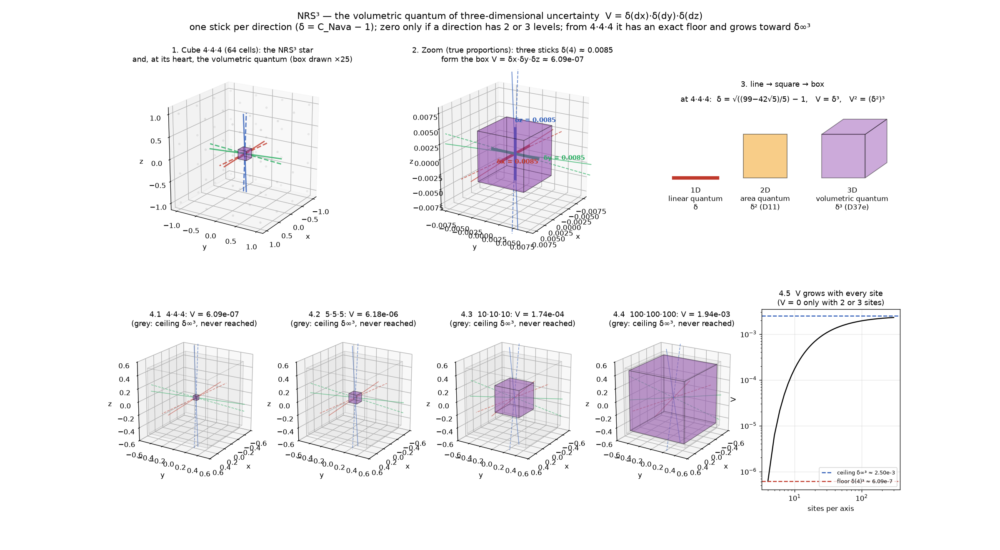
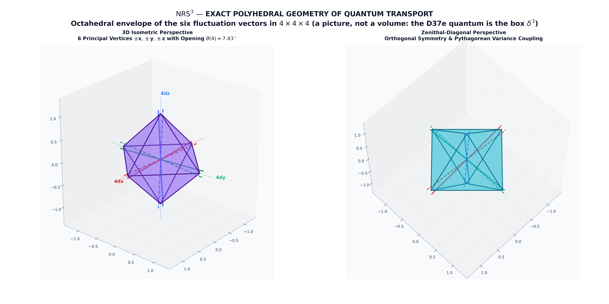
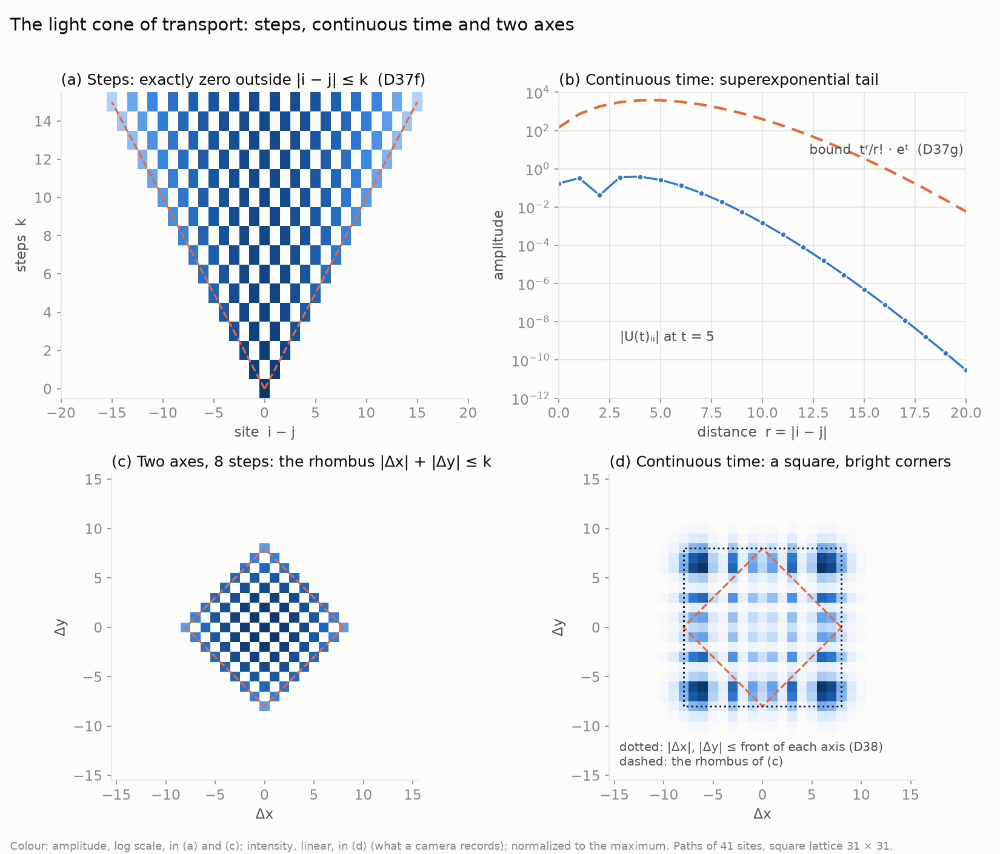
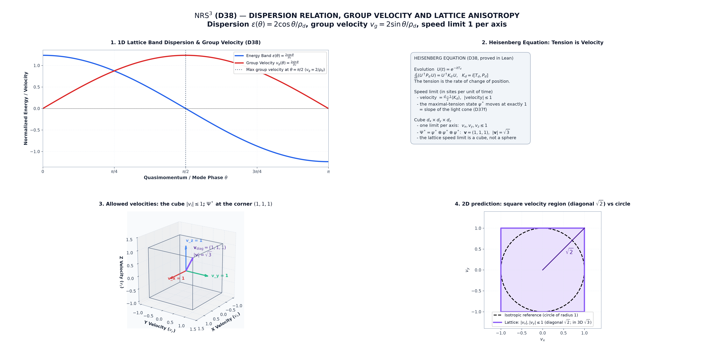
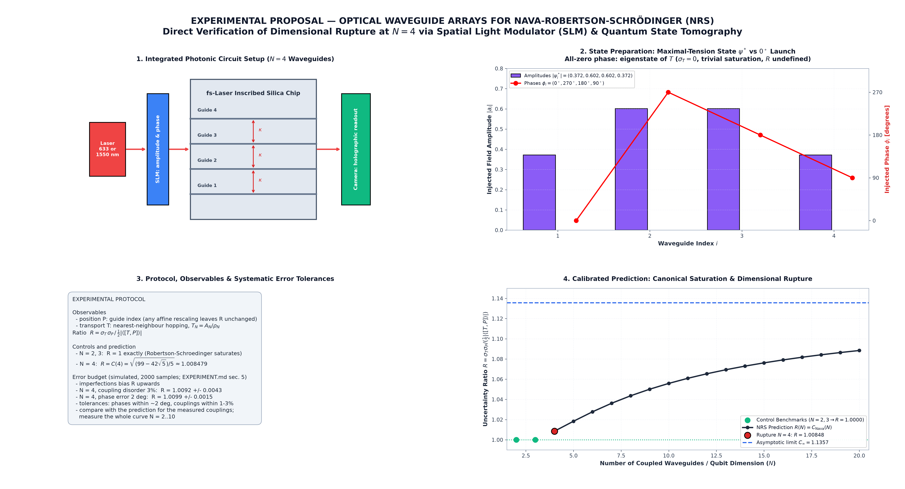

# NRS and NRS³ — Nava–Robertson–Schrödinger Elemental Dimensional Uncertainty

Independent Lean 4 verification package prepared by Eduardo Nava Hernández for
external academic review. Lake fetches the exact Mathlib and physlib revisions recorded in
`lake-manifest.json`; the package does not depend on the BACQM source tree.

On `H_d = ℂ^d`, let `P_d` be the diagonal operator with equispaced eigenvalues in `[−1, 1]` and
`T_d = A_d/ρ_d` the normalized adjacency operator of the path graph on `d` vertices
(`ρ_d = 2 cos(π/(d+1))`); the path graph is the only graph compatible with ordered locality and
completeness (`D3`). **NRS** is the Robertson–Schrödinger inequality for the pair `(T_d, P_d)`,
computed exactly. **NRS³** is its extension to the Cartesian product of three path graphs, the
cube `dx × dy × dz`, with one such pair per factor. All statements are theorems in Lean 4 over
Mathlib (and physlib for `PhyslibBridge`), with no physical constant and no unit. The physical
reading is a separate, declared bridge (see *Declared physical bridge* below).

## The two theorems

**NRS — base theorem (one row, `d` sites).** At the state of maximal tension `ψ*`,

    σ_T · σ_P = C_Nava(d) · ½ |⟨[T_d, P_d]⟩|,      ½ |⟨[T_d, P_d]⟩| = 1/(d−1),

with `C_Nava(d) = 1` exactly for `d = 2, 3` (Robertson–Schrödinger saturates) and
`C_Nava(d) > 1` for every `d ≥ 4` (the algebraic quantum), strictly increasing from `d = 4`
and strictly below `C_∞ = √(π²/3 − 2)`, which no `d` attains (`D8`, `D9`, `D20`, `D21`).
Equivalently, the fluctuation vectors of `T_d` and `P_d` meet at the angle
`θ_NRS(d) = arccos (1/C_Nava(d))`: `0°` for `d = 2, 3`, exactly
`arccos (1/√((99 − 42√5)/5)) ≈ 7.43°` at `d = 4`, rising towards `≈ 28.30°` (`D37b`).
The inequality is physlib's `robertson_schrodinger`, instantiated (`PhyslibBridge`).
From `d = 4` minimum uncertainty and maximal tension exclude each other: at `d = 4` the
minimum-uncertainty states reach tension exactly `1/φ = (√5 − 1)/2`, never more
(`D23f`; upper bound `D23g` in the separate target).

**Localization and tension (the two extremes of NRS).**

* A position eigenvector has zero tension: if `P_d ψ = a ψ` then `⟨ψ, [T_d, P_d] ψ⟩ = 0`
  (`expectation_commutator_eq_zero`, `D23`).
* The maximal-tension state `ψ*` has a nonzero coordinate at every site
  (`fiedlerVec_apply_ne_zero`, `D5`), and `Var T_d · Var P_d > 0` there
  (`variance_mul_variance`, `D21`), so `Var P_d > 0`: no site carries all the weight.
* From `d = 4` no unit state has maximal tension and minimum uncertainty at once: every
  maximal-tension state satisfies Robertson–Schrödinger strictly
  (`strict_inequality_of_maxTension`, `D21`), strictly on a whole band below the maximum
  (`strict_inequality_bandWidth`, `D23d`); at `d = 4` the minimum-uncertainty states reach at
  most `1/φ` of the maximal tension (`D23f`, `D23g`). At `d = 2, 3` one state does both.

**NRS³ — the cube `dx × dy × dz` (product of three path graphs).** One pair `(T, P)` per
factor, acting as `(T_d, P_d)` on that coordinate and as the identity on the other two (`D37`):

* pairs on different axes commute — only `T` and `P` of the same axis collide;
* at `Ψ* = ψ* ⊗ ψ* ⊗ ψ*` each axis satisfies NRS with its own `C_Nava(d_axis)`: it saturates
  only with `2` or `3` sites and is strict from `4` on, on all three axes at once;
* each axis carries its own angle, at least `θ_NRS(4) ≈ 7.43°` and below `≈ 28.30°` (`D37b`);
* **finite isotropy**: if every axis has at least `D` sites, the angles of any two axes differ
  by less than `arccos (1/C_∞) − θ_NRS(D)` (about `1.05°` for `D = 100`) — a statement on
  finite cubes only (`D37b`);
* the spectrum is axis by axis: eigenvalues add, and `Ψ*` is the top of
  `K_x + K_y + K_z` with eigenvalue `Σ 2/(dᵢ − 1)`, which no state exceeds (`D37c`);
* **Pythagoras for uncertainty**: the fluctuation vectors of different axes are orthogonal, so
  `Var(T_x + T_y + T_z) = Var T_x + Var T_y + Var T_z` and the same for `P`; on the cube
  `d × d × d` the total pair meets at exactly `θ_NRS(d)` — at the first rupture `4 × 4 × 4`,
  exactly `θ_NRS(4) ≈ 7.43°` (`D37d`);
* **the volumetric quantum** `𝒱(dx, dy, dz) = δ(dx) · δ(dy) · δ(dz)`, with `δ(d) = C_Nava(d) − 1`
  the dimensional quantum of an axis (`θ_NRS(d) = arccos (1/(1 + δ(d)))`): it vanishes only if
  some axis has `2` or `3` sites; from `4 × 4 × 4` it is strictly positive, at least
  `δ(4)³ = (√((99 − 42√5)/5) − 1)³ ≈ 6.09 × 10⁻⁷`, strictly below `δ_∞³ ≈ 2.50 × 10⁻³`, and
  strictly increasing in each axis; `𝒱(4,4,4)² = (δ(4)²)³` relates it to the area quantum of
  `D11` (`D37e`);
* **light cone**: `T_d` is, up to shift and scale, the Dirichlet discretization of `−d²/dx²` on
  `[−1, 1]` (the particle in a box), so it only connects neighbours; counting time in steps of
  transport, `(T_d^k) i j = 0` whenever `|i − j| > k`, and the edge is reached exactly,
  `(T_d^k) i (i+k) = ρ_d^{−k} ≠ 0` — maximal speed one site per step. On the cube the cone is the
  octahedron `|Δx| + |Δy| + |Δz| ≤ k` (`D37f`);
* **Lieb–Robinson bound**: in continuous time, `U(t) = exp(−i t T_d)` satisfies
  `|U(t)ᵢⱼ| ≤ |t|^r / r! · e^{|t|}` with `r = |i − j|` — outside the cone the amplitude decays
  faster than any exponential in the distance (`D37g`);
* **dispersion and group velocity**: `T_d` has dispersion `ε(θ) = 2 cos θ / ρ_d` with group
  velocity `2 sin θ / ρ_d`, largest at the band centre `θ = π/2`. Position obeys the Heisenberg
  equation `d/dt (U† P_d U) = U† K_d U`, so the tension is velocity: measured in sites, no state
  moves faster than one site per unit of time and `ψ*` moves at exactly that speed, the slope of
  the cone. On the cube each axis has that limit and `Ψ*` reaches it on all three at once:
  velocity `(1, 1, 1)`, Euclidean speed `√3` along the diagonal against `1` along an axis — the
  lattice speed limit is a cube, not a sphere (`D38`).

| Layer | Build target | What it is | Status |
|---|---|---|---|
| **Mathematics** | `NavaRobertsonIndependent.Mathematics` | NRS and NRS³, over Mathlib (plus physlib in `PhyslibBridge`). No physical constant, no unit. | Lean theorems. |
| Certificates (separate) | `NavaRobertsonCertificados` | `D23g`: the `1/φ` ceiling of minimum uncertainty at `d = 4`, with its exact certificates. | Lean theorems. |

This is checked, not just stated: `Verification/Layer1_Mathematics.lean`
computes the import closure of the package and fails if it contains a
module outside `NavaRobertsonIndependent.Mathematics`.

## Figures

Illustrations of NRS³ at the maximal-tension state `ψ* ⊗ ψ* ⊗ ψ*` of the cube. For each axis,
the solid line is the fluctuation vector of `T` and the dashed line that of `P` (drawn in both
senses along the axis). The arrows live in the state space of the cube; each pair is shown next
to the axis it belongs to. Values are exact where stated; magnified drawings say so.

**The star at the first rupture `4 × 4 × 4`.** Each axis opens `θ_NRS(4) ≈ 7.43°`; the three
pairs are mutually perpendicular (`D37b`, `D37d`). Right: `θ_NRS(d)` against the number of sites,
from `0°` at `d = 2, 3` to the floor `θ_NRS(4)` and towards the unattained ceiling `≈ 28.30°`.



**The star in the cube and its growth.** The `4 × 4 × 4` lattice with the star; zoom at true
scale; the same star with the angle drawn `×4`; and the star at `4³`, `8³`, `40³` and at the
ceiling (`D37b`).



**Pythagoras for uncertainty.** At `4 × 4 × 4` the per-axis variances add to the variance of the
total transport: `Var(T_x + T_y + T_z) = Var T_x + Var T_y + Var T_z` (`pythagoras_T`, `D37d`).



**The volumetric quantum.** `V = δ(dx) δ(dy) δ(dz)` with `δ = C_Nava − 1`: the box at the heart
of the star (drawn `×25` in the first panel, true proportions in the second); line → square →
box (`δ`, the area quantum `δ²` of `D11`, `δ³`); growth from the floor `δ(4)³ ≈ 6.09 × 10⁻⁷`
towards the unattained ceiling `δ_∞³ ≈ 2.50 × 10⁻³` (`D37e`).



**The octahedral envelope of the star.** The six fluctuation vectors of `4 × 4 × 4` and the
octahedron they span. This is a picture of the star, not a volume: the volumetric quantum of
`D37e` is the box above.



**The light cone and the Lieb–Robinson bound.** In steps of transport the amplitude is exactly
zero outside `|i − j| ≤ k` (`D37f`); in continuous time it leaks outside the cone but decays
faster than any exponential (`D37g`); on the cube the cone is the octahedron
`|Δx| + |Δy| + |Δz| ≤ k`.



**Group velocity (`D38`).** Dispersion and group velocity of `T_d`; the Heisenberg equation (the
tension is velocity); the allowed velocities on the cube, `|vᵢ| ≤ 1` per axis with `Ψ*` at the
corner `(1, 1, 1)`; and the two-dimensional prediction: a square velocity region, `√2` along the
diagonal, against a circle.



**The experiment.** Preparation of `ψ*` in an array of `N` waveguides, the protocol and error
budget, and the predicted curve `R(N) = C_Nava(N)` with the controls `N = 2, 3`
(see [`docs/EXPERIMENT.md`](docs/EXPERIMENT.md)).



## Declared physical bridge

The theorems above are mathematics. Their physical content rests on one declared
identification, which is a premise and not a Lean theorem:

* **`T_d:P_d` is motion in discrete space.** `P_d` is position on the `d` cells of a row and
  `T_d` is transport, which only connects neighbouring cells.
* **The cube of `D37` is three-dimensional space.** Its three factors are the directions
  `x, y, z`; a site is a cell with three coordinates, and motion changes one coordinate by one
  cell at a time (`D4`: the diagonal is never the minimal step).

Under this bridge, a particle localized at one cell carries no transport tension; at maximal
tension it cannot be localized — it is spread over all the cells, with positive probability at
each and certainty at none (the discrete form of "exact position, completely uncertain
momentum"). From `4` cells on, the most definite states and the most loaded with transport are
never the same. More generally, NRS and NRS³ are statements about discrete space: in every direction with at
least `4` cells the state of maximal tension carries an irreducible angle between position and
transport (at least `≈ 7.43°`, below `≈ 28.30°`), and the three directions agree more closely the
more cells each has. The volumetric quantum `𝒱` is the three-dimensional precision limit of
position and transport: no refinement lowers it (adding cells enlarges it); it is cancelled
only by reducing some direction to `2` or `3` levels.

**Units.** The theorems carry no unit. Units enter through one laboratory datum: the slope of the
light cone (`D37f`, exactly one cell per step; `D37g` in continuous time) is identified with the
measured limiting speed — `c` for motion in space, the coupling `κ` in a waveguide array. That
ties cell to step and leaves a single scale, set by one more measurement. Ratios such as
`C_Nava(d)` and the NRS angle need no calibration: they are the same number on every platform
(see [`docs/EXPERIMENT.md`](docs/EXPERIMENT.md), §6).

## Experimental proposal

The mathematics is proved. The declared bridge is tested by measuring the predicted excess over
the Robertson–Schrödinger floor in a physical system that realizes `T_N:P_N`.

**Systems.** Any system with `N` levels arranged as a line and coupled only to nearest
neighbours with uniform strength:

* a chain of `N` qubits (or spins) with uniform nearest-neighbour exchange, in its
  single-excitation sector: the excitation hops by `A_N` (so `T_N = A_N/ρ_N`), and its site is
  `P_N` (sites relabelled to `[−1, 1]`). This is the setting of quantum state transfer along
  spin chains: the state moves cell by cell, it is not teleported;
* a single `N`-level system (for `N = 4`, a ququart) whose drive couples only consecutive levels
  `0 ↔ 1 ↔ … ↔ N−1`, with `P_N` the level index;
* a photonic waveguide array of `N` guides with equal nearest-neighbour coupling.

Two qubits with independent flips form a square `00–01–11–10–00`, a cycle rather than a line;
the theorems here do not cover that geometry.

**State.** The maximal-tension state `ψ*`: the fundamental sine mode of the path with phases
`(−i)^j` (`D5`, `D21`), `ψ*_j ∝ (−i)^j sin((j+1)π/(N+1))`.

**Measurement.** The spreads `σ_T`, `σ_P` of transport and position in `ψ*` (`P_N` is diagonal in
the site basis; `T_N` is diagonal in the sine-mode basis), and the commutator term
`½ |⟨[T_N, P_N]⟩| = 1/(N−1)`.

**Prediction.** The ratio `R = σ_T σ_P / (½ |⟨[T_N, P_N]⟩|)` equals `C_Nava(N)`:

| sites `N` | `C_Nava(N)` | excess over the floor | NRS angle |
|---|---|---|---|
| 2 | 1 | 0 (saturates — control) | 0° |
| 3 | 1 | 0 (saturates — control) | 0° |
| **4** | **1.008479** | **0.85 %** | **7.43°** |
| 5 | 1.018350 | 1.84 % | 10.89° |
| 6 | 1.027727 | 2.77 % | 13.34° |
| 8 | 1.043563 | 4.36 % | 16.61° |
| 10 | 1.055806 | 5.58 % | 18.71° |
| 20 | 1.088392 | 8.84 % | 23.25° |
| limit | `√(π²/3 − 2)` ≈ 1.135724 | 13.57 % (never reached) | 28.30° |

The table holds for every pair realized on `T_N:P_N`, `A = a T_N + b`, `B = c P_N + e`: units
and origins do not reach the ratio, the angle or the volumetric quantum (`D39`). A pair only
sets its floor, `|a c|/(N − 1)` in its own units. The catalogue of pairs (position–momentum,
number–phase, charge–flux, angle–angular momentum, spin, …) is in [`docs/PAIRS.md`](docs/PAIRS.md);
the table with its explanation, as a PDF: [`docs/NRS_Pairs_Table.pdf`](docs/NRS_Pairs_Table.pdf).

A full design for a photonic waveguide array — state preparation, holographic measurement, error
budget and tolerances — is in [`docs/EXPERIMENT.md`](docs/EXPERIMENT.md).

What would test the bridge: `R = 1` within error for `N = 2, 3`, `R > 1` from `N = 4`, and `R`
growing with `N` along the table. Since the excess at `N = 4` is below 1 %, longer chains give a
larger signal and test the growth at the same time. At `N = 4` a second prediction is available:
states that saturate Robertson–Schrödinger carry tension at most `1/φ ≈ 0.618`, against a
maximal tension of `2/3` (`D23f`, `D23g`). In three dimensions, the same holds on each axis of an
`N × N × N` lattice, and the variances of the three axes add (`D37d`).

## License

[NRS Noncommercial License 1.0.0](LICENSE) — free for noncommercial,
academic, humanitarian and public-institution use, and free to reuse as a
contribution to any open source formal-verification project (Mathlib,
Physlib, Lean 4, or any other). Incorporating this software or its output
into a proprietary/commercial product requires a separate commercial
license — see [LICENSE](LICENSE) §4.

## Reproduce the verification

Requirements: Git, Elan, and network access for the first dependency download.

```bash
lake update
lake exe cache get   # downloads prebuilt Mathlib; without it Mathlib is compiled from source
lake build           # the whole package
lake build NavaRobertsonIndependent.Mathematics   # same target, explicit
lake env lean Verification/Layer1_Mathematics.lean    # boundary + axioms
```

The pinned toolchain is Lean `v4.34.0`; Mathlib is pinned to tag `v4.34.0` and
physlib to commit `1c81053a2ec6542f0de013c163e5db5091cf5b3c`. All headline theorems depend only
on the three standard axioms `propext`, `Classical.choice` and `Quot.sound`;
the package has no `sorry`.

### Separate target: `NavaRobertsonCertificados`

Not built by `lake build`. It contains `D23g`: every minimum-uncertainty state of `H₄`
(Robertson–Schrödinger saturated) carries tension at most `1/φ = (√5 − 1)/2`
(`MinUncertaintyBoundFour.tension_le_of_saturated`). With `D23f`, which exhibits a state
attaining it, `1/φ` is the maximum: `3(√5 − 1)/4 ≈ 92.7 %` of the maximal tension `2/3`.
The proof reduces the claim to an inequality on the densities `|ψⱼ|²` (link currents plus
Cauchy–Schwarz) and closes it with two exact rational Positivstellensatz certificates
(`CotaCasoA`: 207 weighted squares, `CotaCasoB`: 229), found by semidefinite programming,
rounded to exact rationals and checked by `ring`. `CotaCasoA` is a 1 MB polynomial identity,
so this target takes about 20–30 minutes. Both certificates are wrapped to 100 columns; the only
longer lines in `CotaCasoA` are single exact numerals of more than 100 digits, which cannot be split:

```bash
lake build NavaRobertsonCertificados
lake env lean Verification/Certificados.lean          # axioms
```

## NRS — base theorem, modules

- `D0`–`D14`: Hilbert-space setup, Cauchy–Gram and Robertson inequalities,
  finite-path operators, Fiedler/Niven obstruction, Szegő limit, monotonicity,
  and certificates.
- `D16_TransporteSuperficieCerrada`: finite-sum transport to a closed
  orientable surface, including `Ω(Σ_g) = 2g · δ∞` and its radical form. The
  per-cycle defect `δ∞` and `b₁ = 2g` are inputs of the definition, not theorems.
- `D25_CuantoDimensional`: the quantum is dimensional. `dimQuantum d = δ_geom(d)`
  is zero exactly for `d ∈ {2, 3}` (`dimQuantum_three`), positive and strictly
  increasing from `d = 4`, below `δ∞` and converging to it (`dimQuantum_certificate`).
- `D26a_OmegaDesdePi`: `omegaPi = (1 − 1/C∞)·e^{−1/C∞} = 0.04954367888809…`, a
  function of `π` only, with `0.049543679` certified as its 9-digit rounding
  from both sides (`decimal_of_pi`).
- `SumInvSinSq`: the finite cosecant-square identity
  `Σ csc²(kπ/N) = (N²−1)/3` through Chebyshev roots, with the cotangent
  corollaries (v14: the former duplicate `D15` was removed).
- `D17_DefectoIntrinsecoTransporte`: observer-free algebraic interface for any
  position–transport dynamics realizing `(T_d, P_d)`; for `d ≥ 4`, its
  Robertson–Schrödinger defect is strictly positive.
- `D19_VarianzaPosicionFiedler`, `D20_EscalonGramCNava`: closed-form variances
  of `T_d` and `P_d` at the extremal state `ψ*` (the explicit Fiedler mode with
  phase `(−i)^j`) and the Gram step `(d−1)² ‖T_d ψ*‖² ‖P_d ψ*‖² = C_Nava(d)²`,
  with Gram defect `(C_Nava(d)² − 1)/(d−1)²`, equal to zero exactly for
  `d ∈ {2, 3}`.
- `D21_ElementalNRSInequality`: the inequality for the concrete operators
  `(T_d, P_d)`. At `ψ*`: `cov = 0`, `Var T · Var P = (c/2)² (1 + δ_geom)²` with
  `c = −2/(d−1)`, and the Robertson–Schrödinger gap equals
  `(c/2)² δ_geom (2 + δ_geom)`. The top eigenvalue `2/(d−1)` of
  `K_d = i[T_d, P_d]` is simple, so every unit state with `⟨K_d⟩ = 2/(d−1)` is a
  phase of `ψ*` and the strict inequality holds at every such state.
- `D22_InstanciaPosicionTransporteTdPd`: the interface `PositionTransport d` of
  `D17` instantiated with the concrete operators `(T_d, P_d)`; its saturation
  field is a theorem, and the intrinsic defect equals the Gram defect of `D20`.
- `D23_SaturacionAutovectores`: Robertson–Schrödinger is an inequality and equality
  is allowed. On vectors of `Hd d`, the Gram defect vanishes iff `Var B = 0` or
  `Ãψ = c • B̃ψ`; every unit eigenvector of `A − iλB` (`λ` real, `A`, `B` symmetric)
  has `cov = 0` and `Var A · Var B = Im²`. For `d ≥ 4`, no unit eigenvector of
  `T_d − iλP_d` is a maximal-tension state (`⟨K_d⟩ = 2/(d−1)`), the states where
  `D21` gives the strict inequality. In every state with transport, `⟨K_d⟩ ≠ 0`,
  the uncertainty is strictly positive (`Var T · Var P ≥ ⟨K_d⟩²/4 > 0`); the only
  vectors with zero product are those with `⟨K_d⟩ = 0`, such as the canonical basis
  vectors, although `T_d` and `P_d` do not commute. Mathlib-only port of the Physlib
  module `UncertaintySaturation` to vector states.
- `D24_BrechaCuatroAsintota`: the pure gap `Δ = C_∞ − C_Nava(4) = δ_∞ − δ_geom(4)`
  between the first open dimension and the Szegő limit. It is positive, strictly
  below `δ_∞`, strictly bounds the rise of the defect from `d = 4`
  (`δ_geom(d) − δ_geom(4) < Δ`), and is the exact limit of that rise
  (`C_Nava(d) − C_Nava(4) → Δ`). A corollary of `D8` and `D9`; it depends only on
  `π`.

- `D23f_MinUncertaintyTensionFour`: an explicit minimum-uncertainty state of `H₄`, with
  probabilities `(1/8, 3/8, 3/8, 1/8)`, satisfying `T₄ψ = c·P₄ψ` and carrying tension exactly
  `1/φ = (√5 − 1)/2`, i.e. `3(√5 − 1)/4` of the maximum `2/3`. Its upper bound — no
  minimum-uncertainty state of `H₄` goes higher — is `D23g` in the separate target
  `NavaRobertsonCertificados`.
- `PhyslibBridge`: `T_d`, `P_d` as physlib `Observable`s and `ψ*` as a vector state; variance,
  covariance and commutator term coincide with `D21`'s, so the NRS inequality is physlib's
  `robertson_schrodinger` instantiated (`robertson_schrodinger_eq_D21`), strict for `d ≥ 4`
  (`physlib_robertson_schrodinger_strict`).

- `D28_CurvaturaBakryEmery`: the discrete Bakry-Émery curvature of the
  interior of the path graph satisfies `CD(0,2)`, sharp, via an exact
  polynomial identity (the discrete Bochner-Weitzenböck formula,
  `gamma2_eq_bochner`). Neither the curvature lower bound `0` nor the
  effective dimension `2` can be improved: both are witnessed by explicit
  counterexamples (`kappa_zero_sharp`, `dim_two_sharp`). Ties back
  to `D3`'s actual graph edges via `adj_im1`/`adj_ip1`, not an unconnected toy.
- `D28b_CurvaturaOllivier`: the same conclusion, `κ = 0` on the interior,
  from the independent Ollivier-Ricci notion, computed via the
  Kantorovich–Rubinstein dual characterization worked out directly (upper
  bound from the Lipschitz property, lower bound from an explicit witness;
  no Mathlib optimal-transport machinery invoked, to keep the module
  self-contained). `bakryEmery_ollivier_agree` records that the two
  independent discrete-curvature notions agree exactly on a real edge of
  `graphTP d`.

  Together, `D28`/`D28b` are a negative result, not a bridge: the interior of
  the path graph that the whole package is built on (`D3.PathUniqueness`, the
  only graph compatible with locality and completeness) carries no curvature
  to extract, by either standard discrete notion. Any hypothesis coupling a
  physical stretching factor to a curvature measured on `T_d:P_d` gets
  nothing from the graph itself; no such hypothesis is part of this package.

The word "quantum" in `D11_CuantoMinimoArea` means the algebraic quantum
`δ_geom(4)²`, a pure number. This package attaches no physical scale, no SI
unit and no constant to it.


## NRS³ — modules

- `D4_WhyNotDiagonal`: the site of the cube `Fin dx × Fin dy × Fin dz`; the elementary step
  changes one coordinate by one site (lengths `1 < √2 < √3`: the diagonal is never minimal).
- `D37_PathGraph3D`: one pair `(T, P)` per axis (`liftAlong`, `prodAlong`), commuting across
  axes (`conmutador_ejes_distintos_*`); NRS on each axis (`saturation_cube`, `strict_cube`).
- `D37b_NRSAngle`: the NRS angle `cos θ = 1/C_Nava(d)` (`cos_angleNRS`), zero only at
  `d = 2, 3`, strictly increasing, floor `θ(4)` in closed form (`angle_floor`), below
  `arccos (1/C_∞)`; one angle per axis of the cube (`angles_cube`, `angle_floor_cube`);
  finite isotropy (`angleNRS_isotropy`, `finite_isotropy_cube`).
- `D37d_CubePythagoras`: fluctuation vectors of different axes are orthogonal at `Ψ*`
  (`orthogonal_axes_xy/xz/yz`); variances add (`pythagoras_T`, `pythagoras_P`); the total pair of
  the cube `d × d × d` meets at `θ_NRS(d)` (`angle_total_cube`, `angle_total_four`).
- `D37e_VolumetricQuantum`: `volQuantum dx dy dz = δ(dx) δ(dy) δ(dz)`; zero only at a
  seed axis (`volQuantum_eq_zero_iff`), floor `δ(4)³` (`volQuantum_floor`),
  ceiling `δ_∞³` (`volQuantum_lt_ceiling`), strictly increasing per axis, closed form at
  `4 × 4 × 4` (`volQuantum_four`), `𝒱(4,4,4)² = (area quantum)³`
  (`volQuantum_four_sq`); certificate `volQuantum_certificate`.
- `D37f_LightCone`: generic cone for powers of a local matrix (`pow_apply_eq_zero_of_lt`);
  on the path `lightCone`, `lightCone_state` (no signal outruns the cone) and
  `lightCone_edge` / `lightCone_edge_ne_zero` (the edge is reached); on the cube
  `lightCone_cube` for `T_x + T_y + T_z` with the lattice distance.
- `D37g_LiebRobinson`: entries of `exp(−i t T_d)` as a series (`entry_U`), `|(T_dⁿ)ᵢⱼ| ≤ 1`
  (`norm_entry_pow_le`), and the bound `lieb_robinson`.
- `D38_GroupVelocity`: dispersion `hasDerivAt_dispersion`, `Td_mulVec_sineMode`,
  `groupVelocity_le` / `groupVelocity_eq_max_iff`; Heisenberg equation `heisenberg`;
  speed limit `abs_velocity_le`, `velocity_psiStar`, phase modes `velocity_phaseMode`;
  cube `velocities_le`, `velocities_PsiStar3D`, `speed_sq_PsiStar3D`.
- `D39_ConjugatePairs`: affine invariance of the angle and of the ratio (`angleG_affineOp`,
  `ratioG_affineOp`); every pair `(a T_d + b, c P_d + e)` has ratio `C_Nava(d)` at `ψ*`
  (`ratio_pair`), saturates exactly at `d = 2, 3` (`saturated_pair_iff`), opens strictly with `d`
  (`angle_pair_lt_of_lt`) below `arccos (1/C_∞)` (`angle_pair_lt_limit`); on the cube, three
  pairs in their own units give `𝒱(dx, dy, dz)` (`volQuantum_pairs`,
  `volQuantum_pairs_certificate`).
- `D37c_CubeSpectrum`: eigenvectors lift per axis, spectra add (`eigenvector_sum`), and the
  maximal tension of the cube is `Σ 2/(dᵢ − 1)` (`tensionTotal_psiStar`, `tensionTotal_le`).

## Scope of the formal claims

The finite-path, non-saturation, monotonicity, asymptotic, cosecant and
closed-surface statements are formal mathematical theorems in Lean, with no
input beyond Mathlib. The Cauchy–Gram and Robertson–Schrödinger inequalities
are proved in `D1_CauchyGram` and `D2_Robertson` (including the bridge from
any two vectors of a complex Hilbert space, `schrodingerEvaluationOfGram`).

`T_d:P_d` is not one graph picked among others: `D3.PathUniqueness` proves
that any channel satisfying ordered locality (no step skips a neighbor) and
completeness (no minimal step is missing) is forced to be exactly
`SimpleGraph.pathGraph d`. `pathGraph` is the Mathlib name for that unique
object, not a diagram chosen for illustration.

Every formal claim in this repository is a theorem about the operators `T_d`, `P_d` on `ℂ^d`
and their lifts to the product of three path graphs. The physical identification is the
declared bridge above; it is stated, not proved, and nothing in the Lean code depends on it.

The root module `NavaRobertsonIndependent.lean` imports
`NavaRobertsonIndependent.Mathematics` and is the single verification target
for the complete package.
