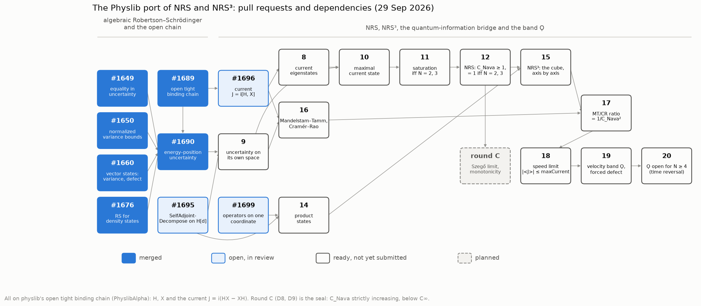
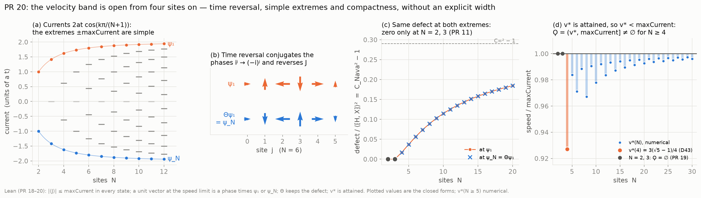

# The Physlib port of NRS and NRS³

This repository proves NRS and NRS³ over Mathlib. In parallel, the results are being contributed
to [physlib](https://github.com/leanprover-community/physlib) (`PhyslibAlpha`), restated on
physlib's own **open tight binding chain**: Hamiltonian `H` (hopping `t`), position `X`
(spacing `a`) and current `J = i(HX − XH)`, the velocity `d⟨X⟩/dt`. The pair `(T_d, P_d)` of
this repository is that chain with `E0 = 0`, `t = −1/ρ_d`, `a = 2/(d − 1)` and `P_d = X − 1`, so each port states
a result of the corpus in the vocabulary of a mainstream physical model.

Every file is Mathlib, Physlib and PhyslibAlpha only, at most 300 lines, lines of at most 100
characters, no `sorry`, only the standard axioms (`propext`, `Classical.choice`, `Quot.sound`),
and passes every PhyslibAlpha linter. Status on 29 September 2026.

## Pull requests

| PR | File (`PhyslibAlpha/…`; `…/` abbreviates the folder, now `ProbabilisticTheory` for the first four) | Lines | Main results | Corpus | Status |
|---|---|---|---|---|---|
| #1649 | `…/CStarAlgebra/Uncertainty` | +60 | equality in Robertson–Schrödinger iff the Gram defect vanishes | `D1`, `D2` | merged |
| #1650 | `…/CStarAlgebra/Uncertainty` | +20 | normalized variance bounds for algebraic states | `D2` | merged |
| #1660 | `…/HilbertSpace/State/VectorUncertainty` | 69 | variance and Gram defect of vector states | `D21` | merged |
| #1676 | `…/HilbertSpace/State/DensityUncertainty` | 107 | Robertson–Schrödinger for density states | `D2` | merged |
| #1689 | `CondensedMatter/TightBindingChain/OpenBoundary` | 145 | open chain, position, `⟨m|[A, X]|n⟩ = a(n − m)⟨m|A|n⟩` | `D3` | merged |
| #1690 | `…/TightBindingChain/Uncertainty` | 95 | energy–position uncertainty, `⁅H, X⁆` moves one site | `D3`, `D21` | merged |
| #1695 | `QuantumMechanics/HilbertSpaces/FiniteTarget/Operators` | 47 | `SelfAdjointDecompose` on operators of `𝓗[d]` | — | open |
| #1696 | `…/TightBindingChain/Current` | 112 | current `J`, stationary and localized states carry none | `D38` | open |
| #1699 | `…/FiniteTarget/Product` | 176 | operators on one coordinate of `𝓗[α × β]` commute across coordinates | `D37` | open |
| 8 | `…/TightBindingChain/CurrentEigenstates` | 180 | `J ψ_k = 2at cos(kπ/(N+1)) ψ_k`, `‖ψ_k‖² = (N+1)/2` | `D5`, `D6` | ready |
| 9 | `…/TightBindingChain/Uncertainty` | 93 (refactor) | the uncertainty relation on the chain's own Hilbert space | — | ready |
| 10 | `…/TightBindingChain/MaxCurrentState` | 298 | maximal current state; `⟨H⟩ = E0`, `⟨X⟩ = a(N−1)/2`, `⟨⁅H, X⁆⟩ = −at cos(π/(N+1))` | `D5`, `D21` | ready |
| 11 | `…/TightBindingChain/Saturation` | 216 | Robertson–Schrödinger is an equality iff `N = 2, 3`, strict for `N ≥ 4` | `D23` | ready |
| 12 | `…/TightBindingChain/ElementalUncertainty` | 144 | `Cov = 0`; `Var H · Var X = (at cos)² + defect`; `CNava ≥ 1`, `= 1` iff `N = 2, 3`; `nava_robertson_schrodinger_elemental_dimensional_uncertainty_inequality` | `D21`, `D22` | ready |
| 14 | `…/FiniteTarget/ProductState` | 236 | product states: one-coordinate statistics are the factor's | `D37` | ready |
| 15 | `…/TightBindingChain/Cube` | 265 | the open cube; axes commute; `C_Nava` per axis; `nava_robertson_schrodinger_cube` | `D37` | ready |
| 16 | `…/TightBindingChain/MandelstamTamm` | 139 | `|⟨J⟩| ≤ 2 ΔH ΔX` (Mandelstam–Tamm), `⟨J⟩²/Var X ≤ 4 Var H` (Cramér–Rao) | `D41` | ready |
| 17 | `…/TightBindingChain/MandelstamTammMaxCurrent` | 134 | the ratio is `1/C_Nava²`, `= 1` iff `N = 2, 3`; per axis of the cube | `D41` | ready |
| 18 | `…/TightBindingChain/SpeedLimit` | 207 | orthonormal basis of current eigenstates; `|⟨J⟩| ≤ 2|at| cos(π/(N+1))` in every state | `D38`, `D40` | ready |
| 19 | `…/TightBindingChain/VelocityBand` | 171 | minimum-uncertainty vectors are compact; the threshold `v*` is attained; forced defect in `Ϙ` | `D44` | ready |
| 20 | `…/TightBindingChain/VelocityBandWidth` | 265 | time reversal; `v* < maxCurrent` and `Ϙ ≠ ∅` for `N ≥ 4` | `D44`, `D46` | ready |
| C | — | ~1250 | Szegő limit and strict monotonicity of `C_Nava` | `D8`, `D9` | planned |

## A new proof that the band is open (PR 20)

`D44` shows `ϙ(d) > 0` for `d ≥ 4` through the explicit width of `D23b`–`D23d`. PR 20 proves
`Ϙ ≠ ∅` without it: time reversal `Θ` (complex conjugation) commutes with `H` and `X`, reverses
`J` and keeps the defect; the extremes `±maxCurrent` of the current are simple, with eigenvectors
the maximal current state `ψ₁` and `ψ_N = Θψ₁`; a unit vector at the speed limit is a phase times
one of them, so it carries the defect of `ψ₁`, positive from four sites on; the threshold `v*` is
attained (compactness), hence `v* < maxCurrent`. The explicit width stays in `D23d`.

Script for both figures: `docs/simulation/figures_physlib_port.py`.
